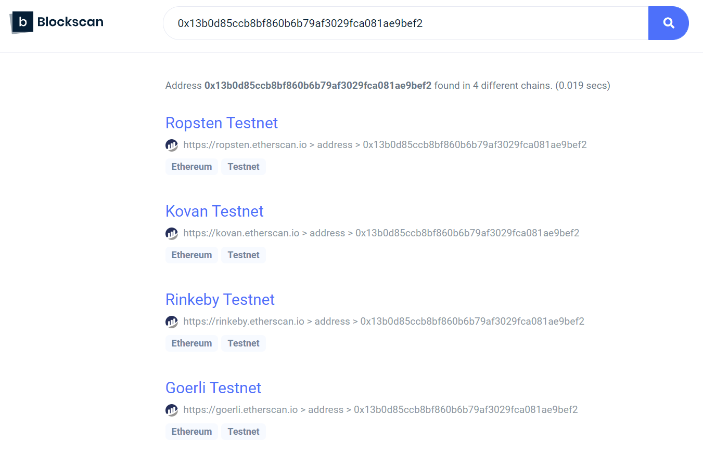

# EVM Cross Deployer
[](https://github.com/pcaversaccio/evm-cross-deployer/actions)


Deploy your smart contracts across multiple EVM chains with the same deterministic address.

<div align="center">
  
</div>

## Unit Tests
Since [Hardhat](https://hardhat.org) implements great features for Solidity debugging like Solidity stack traces, console.log, and explicit error messages when transactions fail, we leverage [Hardhat](https://hardhat.org) for testing:
```bash
npx hardhat test
```
### Test Coverage
This project repository implements a test coverage [plugin](https://github.com/sc-forks/solidity-coverage). Simply run:
```bash
npx hardhat coverage
```

The written tests available in the file [`Create2.test.ts`](https://github.com/pcaversaccio/evm-cross-deployer/blob/main/test/Create2.test.ts) achieve a test coverage of 100%:
```bash
----------------------|----------|----------|----------|----------|----------------|
File                  |  % Stmts | % Branch |  % Funcs |  % Lines |Uncovered Lines |
----------------------|----------|----------|----------|----------|----------------|
 contracts\           |      100 |      100 |      100 |      100 |                |
  Create2Deployer.sol |      100 |      100 |      100 |      100 |                |
----------------------|----------|----------|----------|----------|----------------|
All files             |      100 |      100 |      100 |      100 |                |
----------------------|----------|----------|----------|----------|----------------|
```
> **Important:** A test coverage of 100% does not mean that there are no vulnerabilities. What really counts is the quality and spectrum of the tests themselves. This project is in beta, use at your own risk!

## Test Deployments `Create2Deployer`
- Rinkeby: [`0x13b0D85CcB8bf860b6b79AF3029fCA081AE9beF2`](https://rinkeby.etherscan.io/address/0x13b0D85CcB8bf860b6b79AF3029fCA081AE9beF2)
- Ropsten: [`0x13b0D85CcB8bf860b6b79AF3029fCA081AE9beF2`](https://ropsten.etherscan.io/address/0x13b0D85CcB8bf860b6b79AF3029fCA081AE9beF2)
- Kovan: [`0x13b0D85CcB8bf860b6b79AF3029fCA081AE9beF2`](https://kovan.etherscan.io/address/0x13b0D85CcB8bf860b6b79AF3029fCA081AE9beF2)
- Goerli: [`0x13b0D85CcB8bf860b6b79AF3029fCA081AE9beF2`](https://goerli.etherscan.io/address/0x13b0D85CcB8bf860b6b79AF3029fCA081AE9beF2)

## Hardhat: Programmatic Deployment
Simply run `npx hardhat help xdeploy`:
```bash
Usage: hardhat [GLOBAL OPTIONS] xdeploy --contract <STRING> --deployargs <STRING> --salt <STRING>

OPTIONS:

  --contract    Contract name
  --deployargs  Path to constructor arguments (formatted as array)
  --salt        Salt message

xdeploy: Deploys the contract across all test networks
```

Example:
```bash
npx hardhat xdeploy --contract "ERC20Mock" --salt "WAGMI" --deployargs "./contracts/mocks/deploy-args.json"
```
>*Note:* Using exactly the same salt (`"WAGMI"`) and the mock contract (`"ERC20Mock"`) as above will lead to a transaction revert since a contract has already been deployed to the computed address. Just use another salt and it will work as promised 😀.

The above example deployed the `ERC20Mock` smart contract (including the constructor arguments) across all live test networks at the address `0x13b0d85ccb8bf860b6b79af3029fca081ae9bef2` using only one single CLI instruction!
<div align="center">
  
</div>

## Truffle: Programmatic Deployment
Use hardhat plugin: https://hardhat.org/plugins/nomiclabs-hardhat-truffle5.html.

### Example

## TO DOS
- Frontend
- Automatic download of OpenZeppelin dependencies (similar to Remix)
- Implement automatic smart contract verification (for Etherscan supported chains)
- Using programmatically [WIP]
- Proper error handling
- Fix big number issue with constructor args

The overall goal is to build a hardhat plugin that can be used via a simple configuration:
```bash
xdeploy: {
  networks: ["rinkeby", "kovan", "ropsten", "goerli"],
  contract: ["ERC20Mock"],
  deployargs: ["./contracts/mocks/deploy-args.json"],
  salt: ["WAGMI"]
}
```
