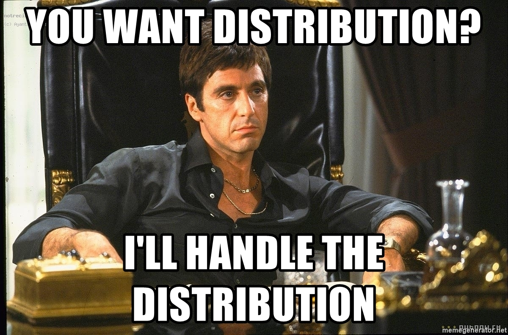

# `CREATE2` Deployer

[](https://github.com/pcaversaccio/create2deployer/actions/workflows/test-contracts.yml)


Helper smart contract to make easier and safer usage of the [`CREATE2`](https://eips.ethereum.org/EIPS/eip-1014) Ethereum Virtual Machine (EVM) opcode. `CREATE2` can be used to compute in advance the address where a smart contract will be deployed, which allows for interesting new mechanisms known as _counterfactual interactions_.

<div align="center">
  
</div>

## Unit Tests

Since [Hardhat](https://hardhat.org) implements great features for Solidity debugging like Solidity stack traces, `console.log`, and explicit error messages when transactions fail, we leverage [Hardhat](https://hardhat.org) for testing:

```bash
npx hardhat test
```

### Test Coverage

This project repository implements a test coverage [plugin](https://github.com/sc-forks/solidity-coverage). Simply run:

```bash
npx hardhat coverage
```

The written tests available in the file [`Create2.test.ts`](https://github.com/pcaversaccio/create2deployer/blob/main/test/Create2.test.ts) achieve a test coverage of 100%:

```bash
----------------------|----------|----------|----------|----------|----------------|
File                  |  % Stmts | % Branch |  % Funcs |  % Lines |Uncovered Lines |
----------------------|----------|----------|----------|----------|----------------|
 contracts\           |      100 |      100 |      100 |      100 |                |
  Create2Deployer.sol |      100 |      100 |      100 |      100 |                |
----------------------|----------|----------|----------|----------|----------------|
All files             |      100 |      100 |      100 |      100 |                |
----------------------|----------|----------|----------|----------|----------------|
```

> **Important:** A test coverage of 100% does not mean that there are no vulnerabilities. What really counts is the quality and spectrum of the tests themselves. This project is in beta, use at your own risk!

## Deployments [`Create2Deployer.sol`](https://github.com/pcaversaccio/create2deployer/blob/main/contracts/Create2Deployer.sol)

- **EVM-Based Production Networks:**
  - Ethereum: [`0x13b0D85CcB8bf860b6b79AF3029fCA081AE9beF2`](https://etherscan.io/address/0x13b0D85CcB8bf860b6b79AF3029fCA081AE9beF2)
  - Binance Smart Chain: [`0x13b0D85CcB8bf860b6b79AF3029fCA081AE9beF2`](https://bscscan.com/address/0x13b0D85CcB8bf860b6b79AF3029fCA081AE9beF2)
  - Optimism: [`0x13b0D85CcB8bf860b6b79AF3029fCA081AE9beF2`](https://optimistic.etherscan.io/address/0x13b0D85CcB8bf860b6b79AF3029fCA081AE9beF2)
  - Arbitrum: [`0x13b0D85CcB8bf860b6b79AF3029fCA081AE9beF2`](https://arbiscan.io/address/0x13b0D85CcB8bf860b6b79AF3029fCA081AE9beF2)
  - Polygon: [`0x13b0D85CcB8bf860b6b79AF3029fCA081AE9beF2`](https://polygonscan.com/address/0x13b0D85CcB8bf860b6b79AF3029fCA081AE9beF2)
  - Heco: [`0x13b0D85CcB8bf860b6b79AF3029fCA081AE9beF2`](https://hecoinfo.com/address/0x13b0D85CcB8bf860b6b79AF3029fCA081AE9beF2)
  - Fantom: [`0x13b0D85CcB8bf860b6b79AF3029fCA081AE9beF2`](https://ftmscan.com/address/0x13b0D85CcB8bf860b6b79AF3029fCA081AE9beF2)
  - Avalanche: [`0x13b0D85CcB8bf860b6b79AF3029fCA081AE9beF2`](https://snowtrace.io/address/0x13b0D85CcB8bf860b6b79AF3029fCA081AE9beF2)
  - Gnosis Chain: [`0x13b0D85CcB8bf860b6b79AF3029fCA081AE9beF2`](https://blockscout.com/xdai/mainnet/address/0x13b0D85CcB8bf860b6b79AF3029fCA081AE9beF2)
  - Moonriver: [`0x13b0D85CcB8bf860b6b79AF3029fCA081AE9beF2`](https://moonriver.moonscan.io/address/0x13b0D85CcB8bf860b6b79AF3029fCA081AE9beF2)
  - Moonbeam: [`0x13b0D85CcB8bf860b6b79AF3029fCA081AE9beF2`](https://moonscan.io/address/0x13b0D85CcB8bf860b6b79AF3029fCA081AE9beF2)
  - Celo: [`0x13b0D85CcB8bf860b6b79AF3029fCA081AE9beF2`](https://celoscan.xyz/address/0x13b0D85CcB8bf860b6b79AF3029fCA081AE9beF2)
  - Aurora: [`0x13b0D85CcB8bf860b6b79AF3029fCA081AE9beF2`](https://aurorascan.dev/address/0x13b0D85CcB8bf860b6b79AF3029fCA081AE9beF2)
  - Harmony: [`0x13b0D85CcB8bf860b6b79AF3029fCA081AE9beF2`](https://explorer.harmony.one/address/0x13b0D85CcB8bf860b6b79AF3029fCA081AE9beF2)
  - Autobahn: [`0x13b0D85CcB8bf860b6b79AF3029fCA081AE9beF2`](https://explorer.autobahn.network/address/0x13b0D85CcB8bf860b6b79AF3029fCA081AE9beF2)
  - Fuse Network: [`0x13b0D85CcB8bf860b6b79AF3029fCA081AE9beF2`](https://explorer.fuse.io/address/0x13b0D85CcB8bf860b6b79AF3029fCA081AE9beF2)
  - Cronos: [`0x13b0D85CcB8bf860b6b79AF3029fCA081AE9beF2`](https://cronoscan.com/address/0x13b0D85CcB8bf860b6b79AF3029fCA081AE9beF2)
  - Evmos: [`0x13b0D85CcB8bf860b6b79AF3029fCA081AE9beF2`](https://evm.evmos.org/address/0x13b0D85CcB8bf860b6b79AF3029fCA081AE9beF2)
  - Boba Network: [`0x13b0D85CcB8bf860b6b79AF3029fCA081AE9beF2`](https://bobascan.com/address/0x13b0D85CcB8bf860b6b79AF3029fCA081AE9beF2)
- **Ethereum Test Networks:**
  - Rinkeby: [`0x13b0D85CcB8bf860b6b79AF3029fCA081AE9beF2`](https://rinkeby.etherscan.io/address/0x13b0D85CcB8bf860b6b79AF3029fCA081AE9beF2)
  - Ropsten: [`0x13b0D85CcB8bf860b6b79AF3029fCA081AE9beF2`](https://ropsten.etherscan.io/address/0x13b0D85CcB8bf860b6b79AF3029fCA081AE9beF2)
  - Kovan: [`0x13b0D85CcB8bf860b6b79AF3029fCA081AE9beF2`](https://kovan.etherscan.io/address/0x13b0D85CcB8bf860b6b79AF3029fCA081AE9beF2)
  - Goerli: [`0x13b0D85CcB8bf860b6b79AF3029fCA081AE9beF2`](https://goerli.etherscan.io/address/0x13b0D85CcB8bf860b6b79AF3029fCA081AE9beF2)
  - Sepolia: [`0x13b0D85CcB8bf860b6b79AF3029fCA081AE9beF2`](https://sepolia.etherscan.io/address/0x13b0D85CcB8bf860b6b79AF3029fCA081AE9beF2)
- **Additional EVM-Based Test Networks:**
  - Binance Smart Chain Testnet: [`0x13b0D85CcB8bf860b6b79AF3029fCA081AE9beF2`](https://testnet.bscscan.com/address/0x13b0D85CcB8bf860b6b79AF3029fCA081AE9beF2)
  - Optimism Testnet (Kovan): [`0x13b0D85CcB8bf860b6b79AF3029fCA081AE9beF2`](https://kovan-optimistic.etherscan.io/address/0x13b0D85CcB8bf860b6b79AF3029fCA081AE9beF2)
  - Optimism Testnet (Goerli): [`0x13b0D85CcB8bf860b6b79AF3029fCA081AE9beF2`](https://blockscout.com/optimism/goerli/address/0x13b0D85CcB8bf860b6b79AF3029fCA081AE9beF2)
  - Arbitrum Testnet (Rinkeby): [`0x13b0D85CcB8bf860b6b79AF3029fCA081AE9beF2`](https://testnet.arbiscan.io/address/0x13b0D85CcB8bf860b6b79AF3029fCA081AE9beF2)
  - Polygon Testnet (Mumbai): [`0x13b0D85CcB8bf860b6b79AF3029fCA081AE9beF2`](https://mumbai.polygonscan.com/address/0x13b0D85CcB8bf860b6b79AF3029fCA081AE9beF2)
  - Heco Testnet: [`0x13b0D85CcB8bf860b6b79AF3029fCA081AE9beF2`](https://testnet.hecoinfo.com/address/0x13b0D85CcB8bf860b6b79AF3029fCA081AE9beF2)
  - Fantom Testnet: [`0x13b0D85CcB8bf860b6b79AF3029fCA081AE9beF2`](https://testnet.ftmscan.com/address/0x13b0D85CcB8bf860b6b79AF3029fCA081AE9beF2)
  - Avalanche Testnet (Fuji): [`0x13b0D85CcB8bf860b6b79AF3029fCA081AE9beF2`](https://testnet.snowtrace.io/address/0x13b0D85CcB8bf860b6b79AF3029fCA081AE9beF2)
  - Sokol: [`0x13b0D85CcB8bf860b6b79AF3029fCA081AE9beF2`](https://blockscout.com/poa/sokol/address/0x13b0D85CcB8bf860b6b79AF3029fCA081AE9beF2)
  - Moonbeam Testnet (Moonbase Alpha): [`0x13b0D85CcB8bf860b6b79AF3029fCA081AE9beF2`](https://moonbase.moonscan.io/address/0x13b0D85CcB8bf860b6b79AF3029fCA081AE9beF2)
  - Celo Testnet (Alfajores): [`0x13b0D85CcB8bf860b6b79AF3029fCA081AE9beF2`](https://alfajores.celoscan.xyz/address/0x13b0D85CcB8bf860b6b79AF3029fCA081AE9beF2)
  - Aurora Testnet: [`0x13b0D85CcB8bf860b6b79AF3029fCA081AE9beF2`](https://testnet.aurorascan.dev/address/0x13b0D85CcB8bf860b6b79AF3029fCA081AE9beF2)
  - Harmony Testnet: [`0x13b0D85CcB8bf860b6b79AF3029fCA081AE9beF2`](https://explorer.pops.one/address/0x13b0D85CcB8bf860b6b79AF3029fCA081AE9beF2)
  - Fuse Network Testnet (Spark): [`0x13b0D85CcB8bf860b6b79AF3029fCA081AE9beF2`](https://explorer.fusespark.io/address/0x13b0D85CcB8bf860b6b79AF3029fCA081AE9beF2)
  - Cronos Testnet: [`0x13b0D85CcB8bf860b6b79AF3029fCA081AE9beF2`](https://cronos.org/explorer/testnet3/address/0x13b0D85CcB8bf860b6b79AF3029fCA081AE9beF2)
  - Evmos Testnet: [`0x13b0D85CcB8bf860b6b79AF3029fCA081AE9beF2`](https://evm.evmos.dev/address/0x13b0D85CcB8bf860b6b79AF3029fCA081AE9beF2)
  - Boba Network Testnet: [`0x13b0D85CcB8bf860b6b79AF3029fCA081AE9beF2`](https://testnet.bobascan.com/address/0x13b0D85CcB8bf860b6b79AF3029fCA081AE9beF2)
